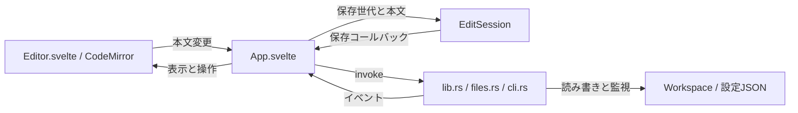

# Nagoriのアーキテクチャ

更新日2026-10-04。現在の実装を説明する。アプリの仕様は[仕様書](specification.md)、実装と確認の進捗は[検証状況](verification.md)を参照する。

## 全体構成

NagoriはTauriのmacOSアプリ。RustがローカルファイルとOS操作を担当し、WKWebView内でSvelteの画面とCodeMirrorのエディタを動かす。TypeScriptのフロントエンドからTauriのinvokeでRustのコマンドを呼び、Rustからイベントで変更を通知する。

Viteはフロントエンドをビルドする。Node.jsは開発・ビルド・テストで使い、配布アプリや同梱CLIの実行には不要。本文はWorkspace内のMarkdownファイル、設定はアプリ設定ディレクトリのJSONへ保存する。



## ファイル構成

```text
Nagori/
├── README.md                  利用・起動・ビルドの入口
├── AGENTS.md                  Git運用と日本語の書き方
├── index.html                 WebViewのHTML
├── package.json / package-lock.json
├── vite.config.ts / tsconfig.json
├── src/
│   ├── main.ts                Svelte起動とCSS読み込み
│   ├── App.svelte             Workspace、画面、保存と操作の順序
│   ├── app.css                レイアウトとテーマトークン
│   └── lib/
│       ├── Editor.svelte      CodeMirrorとツールバー、検索、IME
│       ├── Outline.svelte     目次の表示とキー操作
│       ├── PaneResizer.svelte 境界線のドラッグとキー操作
│       ├── paneWidths.ts      幅の範囲と配置の計算
│       ├── outline.ts         構文木から見出しを抽出し、現在の節を判定
│       ├── FileTree.svelte    ファイルツリーの行と名前の入力欄
│       ├── QuickOpen.svelte   Quick Openの検索とキー操作
│       ├── ProblemDialog.svelte  保存失敗・競合のダイアログ
│       ├── SaveAsDialog.svelte   別名保存のダイアログ
│       ├── appFlow.ts         保存、外部変更の確認、終了の呼び出し順
│       ├── session.ts         保存世代と保存状態
│       ├── livePreview.ts     記法の表示切替と各種Widget
│       ├── markdown.ts        Markdown解析の共通設定と参照解決
│       ├── editor.ts          Editorの操作APIとメニュー通知の型
│       ├── blockEdit.ts       段落操作の差分と適用可否の判定
│       ├── markdownMath.ts    数式の範囲と本文の抽出
│       ├── mathjax.ts         遅延読み込みする数式描画
│       ├── math.css           数式表示のスタイル
│       ├── navigation.ts      Quick Openの候補評価
│       ├── image.ts           画像データのMIMEタイプ判定
│       ├── settings.ts        設定初期値と初回のテーマ判定
│       ├── Icon.svelte        UIアイコン
│       └── assets/            Nagoriロゴとタイトル画像
├── src-tauri/
│   ├── Cargo.toml / Cargo.lock
│   ├── build.rs               Tauriのビルド処理
│   ├── tauri.conf.json        ウィンドウ、CSP、配布設定
│   ├── capabilities/default.json
│   ├── icons/                 アプリアイコン
│   └── src/
│       ├── main.rs            Rustの起動入口
│       ├── lib.rs             IPC、Workspace、監視、メニュー、終了
│       ├── files.rs           パス検証とファイル操作
│       └── cli.rs             CLI登録・解除
├── scripts/
│   ├── nagori                 macOSのopenを呼ぶ起動スクリプト
│   ├── cli-link.sh            CLIリンクの作成・解除
│   └── release-sign.sh        外部配布用の署名・公証ビルド
├── tests/                     Node標準テスト
├── test-documents/            手動閲覧用Markdown
├── design/                    提供されたブランド・UI資料
└── docs/
    ├── README.md              開発資料の目次
    ├── architecture.md        この文書
    ├── specification.md       MVP仕様
    ├── implementation-plan.md 現在地と今後の作業順
    ├── verification.md        確認済みの範囲と未確認項目
    ├── performance/           メモリ・ブラウザ測定とJSONデータ
    └── history/               整理前の計画と検証記録
```

ビルド時に生成されるdistとsrc-tauri/targetは上の図から省いた。製品アプリはsrc-tauri/target/release/bundle/macos/Nagori.app、DMGは同じbundle配下のdmgに生成する。生成物の中身はソースファイルとして編集しない。

## フロントエンドの担当

| ファイル | 担当 |
|---|---|
| [App.svelte](../src/App.svelte) | Workspaceと現在の記事、ツリーとダイアログの状態、CLI要求、保存予約、外部変更、画像URLの寿命、Rustとの通信 |
| [FileTree.svelte](../src/lib/FileTree.svelte) / [QuickOpen.svelte](../src/lib/QuickOpen.svelte) / [ProblemDialog.svelte](../src/lib/ProblemDialog.svelte) / [SaveAsDialog.svelte](../src/lib/SaveAsDialog.svelte) | ツリー、Quick Open、保存失敗・競合、別名保存の表示とキー操作。状態の変更はApp.svelteへ返す |
| [Editor.svelte](../src/lib/Editor.svelte) | EditorViewの生成・破棄、編集とUndo、検索、IME通知、選択ツールバー、Live Preview / Preview切替 |
| [session.ts](../src/lib/session.ts) | 保存対象の本文、変更世代、保存済み世代、ディスク比較基準、直列保存、保存失敗の保持 |
| [livePreview.ts](../src/lib/livePreview.ts) | 構文木と選択からDecorationを作り、表・画像・数式をWidgetで表示 |
| [markdown.ts](../src/lib/markdown.ts) / [editor.ts](../src/lib/editor.ts) | 共通Markdown解析と参照定義、装飾の適用・解除、編集可能な選択範囲 |
| [markdownMath.ts](../src/lib/markdownMath.ts) / [mathjax.ts](../src/lib/mathjax.ts) | 数式抽出、TeXからCHTMLへの変換、式番号・ラベル・記事内マクロ、ローカルフォント |
| [navigation.ts](../src/lib/navigation.ts) / [settings.ts](../src/lib/settings.ts) | ファイル検索の候補評価、設定値と初回テーマ判定 |

編集本文・選択・Undo履歴はCodeMirrorが管理する。本文変更をApp.svelteへ通知し、EditSessionが保存対象の本文と世代を保持する。App.svelteはディスクから読み込んだ本文をEditorへ渡し、保存結果に応じて状態表示を更新する。

Previewは既存のEditorViewと編集状態を使う。記法の露出と本文変更を禁止し、選択・検索・コピーを維持する。ファイルの読み取り専用状態、操作中のロック、閲覧専用モードは別々に扱う。

本文の右クリックメニューはApp.svelteがTauriのMenuで組み立てる。Editor.svelteはTauriに依存せず、クリック位置と編集可否を通知し、段落操作のAPIを公開する。本文領域で右クリックとShift＋F10を受けるため、イベントを無視する表・画像・数式Widgetでもメニューを開ける。

blockEdit.tsは既存のMarkdown解析から保護対象を判定し、行ごとの差分と挿入後の選択を返す純粋関数。Editor.svelteは差分を1回のトランザクションで適用し、Undoを前後の入力から分ける。記事・本文・選択の変更を検出して古いメニューの操作を止め、適用直前にも編集可否を確認する。

標準の編集項目はTauriの定義済み項目を使う。ただし定義済み項目には無効状態を指定するAPIがないため、編集できない時の切り取りと貼り付けだけは無効な通常項目へ置き換える。コピーと全選択は定義済み項目を維持する。既存の`core:menu:default`権限で構成できるため、Rustと権限設定は変更しない。

Editor.svelteは本文の変更を150msまとめ、CodeMirrorのsyntaxTreeから見出し1〜4を取り出してApp.svelteへ通知する。長文の解析が末尾まで進んでいない時は20msずつ進め、未完なら次回へ回す。文字の整形と現在の節の二分探索はoutline.tsで行う。Outline.svelteはボタンをnav内に並べ、移動はEditorApi.goToHeadingを通して行う。表示幅はapp.cssのコンテナクエリで判定し、本文のEditorViewを作り直さない。

本文の表示領域はResizeObserverで測り、その高さの半分をcm-contentの下側のpaddingへ設定する。CodeMirrorが測るスクロール高にも余白が含まれるため、scrollRestore.tsの末尾判定は同じ寸法を使える。目次の現在位置は本文上端の行と見出しの位置で判定する。

## RustとOSの担当

[lib.rs](../src-tauri/src/lib.rs)がTauriのコマンドを登録し、BackendにWorkspaceのルートと監視、起動要求のキュー、終了許可の状態を保持する。Workspaceのファイル処理はspawn_blockingで実行し、1つのMutexで順序を揃える。設定保存とCLI登録もブロッキング処理を別の実行枠へ移す。

Markdown以外のファイルも、files.rsのopenが中身をUTF-8かつNUL文字なしと判定できればテキストとして返す。App.svelteは種類がotherのファイルをplainとしてEditorへ渡し、EditorはMarkdownの解析・Live Preview・装飾ツールバーを付けずに等幅で表示する。保存の流れはMarkdownと共通。

[files.rs](../src-tauri/src/files.rs)が読み書き、一覧と索引、作成・名前変更・ゴミ箱、画像読み込み・取り込みを担当する。Workspaceのパス範囲、除外項目、シンボリックリンク、UTF-8、サイズ・画像寸法を検証する。画像取り込み元と設定保存先は、通常のWorkspace参照と用途を分けて処理する。

notifyでWorkspaceを再帰監視し、nagori:fs-changedとnagori:fs-errorを通知する。App.svelteが通知を受けて、展開中のフォルダ・記事・画像を確認し直す。プロジェクト全体の索引は、Quick Openを開く時と前回のファイルを復元する時だけ作る。通知だけでファイルの内容を確定せず、保存時にもRust側でディスクの比較基準を確認する。

ネイティブメニューはnagori:menu、終了要求はnagori:quit-requested、CLIからの起動要求はnagori:open-requestedで画面へ伝える。設定JSONはapp_config_dirのsettings.json。前回Workspaceと記事、最近開いたファイル、テーマ、本文サイズを保存する。

## 主な処理の流れ

### 編集と保存

本文変更をEditSession.editへ渡し、変更世代を進める。App.svelteは500ms後の保存を予約する。IME変換中は予約を止め、確定後の本文同期を待って保存を再開する。

ファイル切替、名前変更、削除、終了はApp.svelteの共通operationとflushを通る。EditSessionは保存中の追加編集を区別し、保存できた世代だけを完了にする。失敗や競合では本文と問題を保持し、操作を先へ進めない。

Rustは元ファイルの比較基準、存在、読み取り専用状態を確認する。同じフォルダの一時ファイルへ書き、BOM・改行形式・アクセス権を保持して、置き換え直前にも比較する。外部アプリの書き込みとの競合を完全に排除する仕組みではない。保存失敗時は再試行・別名保存などを画面から選ぶ。

### Live Previewと数式

CodeMirrorの構文木からMarkdownの装飾を作る。Live Previewではカーソルや選択を含む要素の記法を表示する。IME中は既存Decorationを変更量に追従させ、Widgetの再構築を確定まで保留する。

数式は必要になるまでmathjax.tsを読み込まない。本文全体から式を順に収集し、画面外の式も含めてラベルと前方参照を解決する。記事ごとにTeXのマクロと式番号を初期化し、生成したCHTMLだけをDOMへ反映する。フォントと追加データはアプリへ同梱する。

数式の結果は同じ本文のContextで共有するが、全mountが撤去されると結果を破棄する。一度読み込んだMathJaxとフォントモジュールは残る。現在の保持量と調査の限界は[メモリ調査](performance/memory.md)に記録する。

### 画像

Rustが画像の形式・サイズ・寸法と参照先を検証し、画像データをJSONに変換せずバイナリのまま返す。表示用には最後までのデコードを行わず、WebViewのデコードに任せる。App.svelteは返されたデータからBlob URLを作り、同じ記事内の取得結果を再利用する。記事切替・更新時にURLを解放し、古い非同期結果を新しい記事へ反映しない。

画像挿入では取り込む画像を最後までデコードして破損を確かめてから、記事の隣のassetsへコピーし、成功後に相対パスの記法を本文へ挿入する。同名画像を上書きしない。画像の貼り付けでは、Editor.svelteが画像だけのクリップボードを見分け、App.svelteがバイト列をJSONに変換せずimage_pasteへ送る。Rustは同じ検証と保存処理を使い、pasted-imageの名前でassetsへ保存する。中央の画像プレビューも同じRustの画像読み込みを使う。

### CLIと終了

scripts/nagoriはパスを解決し、同梱元のNagori.appをmacOSのopenで開く。TauriのOpenedイベントで要求をキューへ入れ、App.svelteが準備後に取り出す。起動中の要求はIME終了と保存を待って既存ウィンドウで処理する。

アプリメニューの登録・解除はcli.rsを呼び、同梱のcli-link.shが/usr/local/bin/nagoriへのリンクを作る。Applicationsへ置いたアプリから登録し、権限が足りなければmacOSの管理者認証を使う。別のコマンドを上書きせず、自分のリンクだけを解除する。

閉じる・終了要求はRustが一度止め、画面側の保存と設定保存を待つ。成功後にapp_exitが終了許可を設定してアプリを終了する。実際のMac IME、認証画面、各終了経路の確認状況は[検証状況](verification.md)を参照する。

## 設定・制限・テストの配置

App.svelteは保存済みの幅とドラッグ中の幅を分け、paneWidths.tsで表示する幅を計算する。本文720pxと左右余白128pxを残し、目次が入らない時は隠す。ウィンドウを狭くした時の幅は表示だけに使い、保存済みの幅を変えない。PaneResizer.svelteはPointer Captureで境界線の外へ出たドラッグも受け取り、終了時に既存の設定保存キューへ1回だけ追加する。本文の編集・IME・保存の処理は呼び出さない。

設定のsidebarWidthは200〜420pxで初期値272px、outlineWidthは180〜360pxで初期値220px。settings.tsは起動時に範囲を調べる。files.rsのSettingsはserdeの既定値で旧版を読み、幅のデシリアライズとシリアライズの両方で範囲外を初期値へ戻す。Nodeテストで表示境界と幅の計算、Rustテストで旧版の設定・範囲の上下限・範囲外からの復帰を確認する。

[tauri.conf.json](../src-tauri/tauri.conf.json)にアプリ識別子、ウィンドウ、CSP、同梱CLI、配布と署名の設定を置く。[default.json](../src-tauri/capabilities/default.json)でイベント・メニュー・ファイル選択・ウィンドウ操作の権限を宣言する。任意のHTMLや外部数式資産を読み込む設計にはしていない。

現在の文書編集は.mdと.markdownのUTF-8・2MiB以下。画像はPNG・JPEG・GIF・WebP、20MiB以下・1,600万画素以下。原文保持や数式の上限を含む詳しい条件は[仕様書](specification.md)を参照する。

[tests](../tests/)はNode標準テストで保存世代、編集・プレビュー、設定、CLIを確認する。Rustのテストはfiles.rs、lib.rs、cli.rsの各モジュール内に置き、一時ディレクトリでファイル操作と入力検証を行う。[test-documents](../test-documents/)は手動閲覧用で、自動テストとは用途が異なる。
